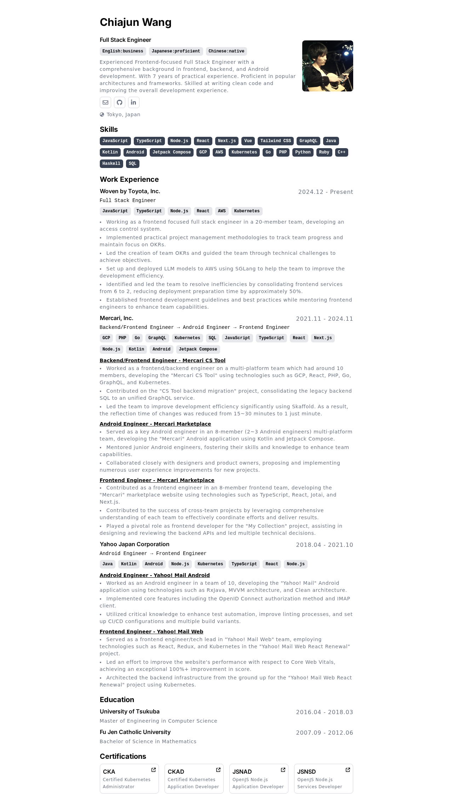

https://ibara1454-resume.vercel.app

<div style="width: 100%; display: flex; justify-content: center;">
  
</div>

# Resume

Minimalist resume template which is inspired by https://github.com/BartoszJarocki/cv.

Built with [Astro](https://astro.build/) and React.

## 🚀 Project Structure

The `src/` directory contains the source code. To customize the personal information used to generate the resume, you can edit [profile.ts](./src/data/profile.ts).

Any static assets, such as images, can be placed in the `public/` directory.

## 🧞 Commands

Valid commands are:

| Command             | Action                                           |
| :------------------ | :----------------------------------------------- |
| `npm install`       | Installs dependencies                            |
| `npm run dev`       | Starts local dev server                          |
| `npm run build`     | Build your production site to `./dist/`          |
| `npm run preview`   | Preview your build locally, before deploying     |
| `npm run astro ...` | Run CLI commands like `astro add`, `astro check` |

## How to run tests

Install dependent libraries for Playwright:

```sh
npx playwright install --with-deps chromium
```

Run visual regression tests with [Playwright](https://playwright.dev/):

```sh
npm run test
```

Update screenshots:

```sh
npm run test:update
```
